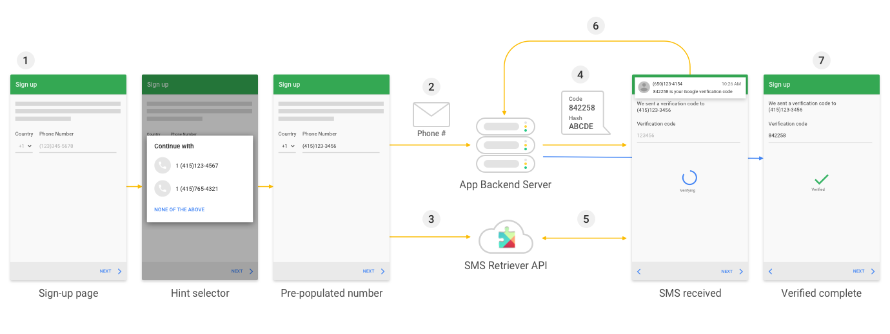
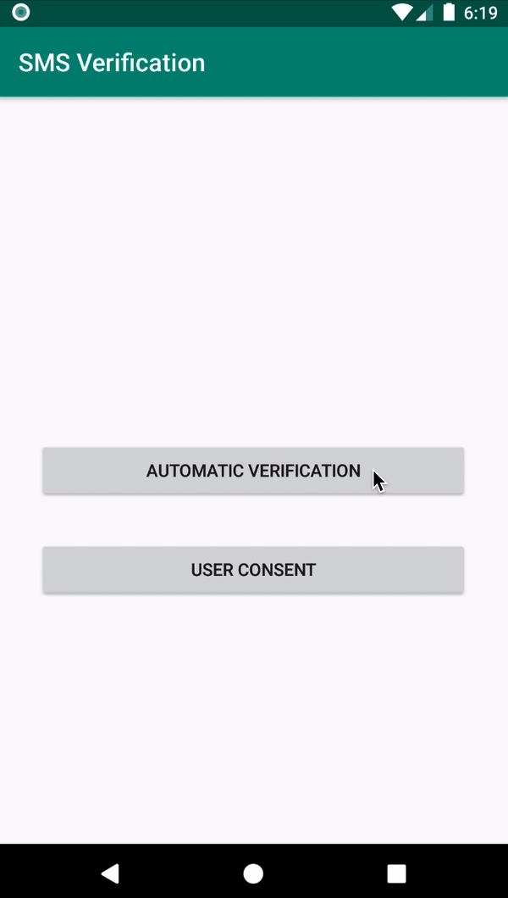
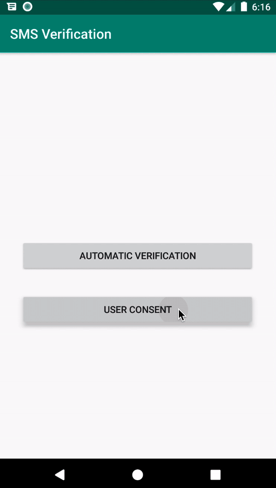

# Verificación basado en SMS

Google Play services tiene dos APIs que se pueden usar para agilizar el proceso de verificación basado en SMS: `SMS Retriever API` y el `SMS User Consent API`

El `SMS Retriever API` provee un una experiencia totalmente automática y debe ser usada en la medida de lo posible. Este flujo requiere que se coloque un código en el cuerpo del mensaje, esto puede ser algo dificil si no somos o no tenemos el control de quien envía ese mensaje.

Si no tenemos control sobre el contenido del mensaje-por ejemplo, si la aplicación trabaja con una institución financiera que podría querer verificar el número telefónico del usuario antes de aprobar una transacción de pago dentro de la aplicación-entonces se debe usar el `SMS User Consent API`, el cual no requiere un código hash personalizado. Para minimizar las posibilidades de que al usuario se le muestre un mensaje incorrecto, `SMS User Consent` verificará si el mensaje contiene un codigo entre 4-10 caracteres alfanuméricos y al menos un número.

Resumen de diferencias resumidas en la siguiente tabla:

 | SMS Retriever | SMS User Consent
------|---------------|-----------------
Requerimientos del mensaje | 11 dígitos | código de 4-10 dígitos alfanumérico con al menos un número
Requerimientos del emisor | Ninguno | Emisor no puede estar en la lista de contactos del usuario
Interacción del usuario | Ninguno | Un "toque" para aprobar

## Verificación Automática SMS
Con el `SMS Retriever API`, puedes desarrollar la verificación del usuario basado en SMS sin requerir al usuario que ingrese manualmente la verificación del código y sin requerir algún permiso extra a la apliación. Cuando se implementa la verificación automática del SMS dentro de la aplicación, el flujo es similar a lo siguiente:



1. Un usuario inicializa la verificación del SMS en la aplicación. La aplicación podría solicitar al usuario proveer un número de teléfono o usar `Smart Lock for Passwords hint selector` si esa información no fue requerido para crear la cuenta del usuario.
2. La aplicación realiza una solicitud a nuestro backend para verificar el número telefónico del usuario. Dependiendo de que información es disponible en nuestra base de datos, esta solicitud podría incluir el ID, el número telefónico del usuario, o ambos.
3. Al mismo tiempo, la aplicación llama al `SMS Retriever API` para iniciar a escuchar la respuesta del SMS desde el backend.
4. El backend envía un mensaje SMS al usuario que incluye un código de un solo uso para ser enviado al backend, y un hash que indentifica a la aplicación.
5. Cuando el dispositivo del usuario recibe el mensaje SMS, Google Play services usa el has de la aplicación a través del `SMS Retriever API`.
6. La aplicación analiza desde la aplicaciónel código de un solo uso y finalmente graba que el usuario ha verificado satisfactoriamente el contenido del SMS.

<p align="center">
	
</p>

Para el uso de `SMS Retriever API` se necesita que el SMS tenga las siguientes consideraciones:

* El SMS debe comenzar con <#>
* El SMS debe terminar con el código hash de la aplicación.

## Verificación en un solo toque
El `SMS User Consent API` complementa al `SMS Rertiever API` por permitira en la aplicación el consentimiento al usuario para conceder acceso al contenido de un solo mensaje SMS. Cuando un usuario da el consentimiento, la aplicación tendrá luego al cuerpo del mensaje entarmente para completar automaticamente la verificación del SMS.

> El `SMS Retriever API` ofrece la mejor experiencia de usuario para automatizar el proceso de verificación basado en SMS. Sin embargo, en la situaciones donde no se tiene el control del formato del mensaje SMS, se puede usar esta API para agilizar el proceso.

Cuando se usa el `SMS User Consent API` para llenar automaticamente el código de un solo uso se pedirá el consentimiento del usuario para leer ese único mensaje SMS.

### Flujo SMS User Consent API

Para implementar un flujo completo de verificación de SMS usando `User Consent API` se necesita interactuar tanto con el backend para enviar el SMS así como también el `User Consent API` para solicitar al usuario el acceso a un solo mensaje que contiene el código de un solo uso.

La aplicación y el servidor debe hacer lo siguiente para implementar el flujo de verificación del SMS usando `SMS User Consent API`:

<p align="center">
	
</p>

1. La aplicación llama al `SMS User Consent API` para comenzar a escuchar la respuesta del SMS del backend. Un mensaje SMS recibido antes de iniciar el `SMS User Consent` no se reenviará a la aplicación.
2. Luego de comenzar el `SMS User Consent API`, la aplicación realiza una solicitud al backend para verificar el número telefónico del usuario usando verificación SMS.
3. Cuando el dispositivo del usuario recibe el mensajer SMS que contiene el código de un solo uso. Google Play services muestra el contenido del mensaje al usuario y solicita el consentimiento para hacer disponible el texto para la aplicación.
4. Si el usuario da el consentimiento, la totalidad del mensaje SMS está disponible a la aplicación
5. La aplicación analiza el código de un solo uso del mensaje de texto y lo envía al backend.

## Consideraciones
> `SMS Retriever API` está disponible solo en dispositivos con Play services versión 10.2 y posteriores.

> Se recomienda utilizar Java 8+

## Gradle
```gradle
implementation "com.google.android.gms:play-services-auth:<insert-latest-version>"
implementation "com.google.android.gms:play-services-auth-api-phone:<insert-latest-version>"
```

Esta aplicación usa las versiones 17.0.0 de `play-services-auth`y 17.3.0 para `play-services-auth-api-phone`

## Código

### SMS Retriever API
Cuando se está listo para verificar el número telefónico, obtenemos una instancia de `SmsretrieverClient`, llamamos a `startSmsRetriever` y se adjunta los escuchadores para el exito y fallo de la tarea de recibir el SMS.

```kotlin
val task = SmsRetriever.getClient(this).startSmsRetriever()
```

Escuha el exito del comienzo de la tarea.

```kotlin
task.addOnSuccessListener {
	Log.d(TAG, "LISTENING_SUCCESS")
}
```
Escucha el fallo del comienzo de la tarea.

```kotlin
task.addOnFailureListener {
	Log.d(TAG, "LISTENING_FAILURE")
}
```


Este boradcast espera el mensaje SMS. Este puede ser registrado o en el `AndroidManifest` o en tiempo de ejecución. Debe filtrar 'Intents' en `SmsRetriever.SMS_RETRIEVED_ACTION`

```kotlin
class AutomaticVerificationBroadcastReceiver : BroadcastReceiver() {
    lateinit var automaticVerificationBroadcastReceiverListener: AutomaticVerificationBroadcastReceiverListener

    override fun onReceive(context: Context?, intent: Intent?) {
        if (intent?.action == SmsRetriever.SMS_RETRIEVED_ACTION) {

            val extras = intent.extras
            val status = extras?.get(SmsRetriever.EXTRA_STATUS) as Status

            when (status.statusCode) {
                // Get SMS message contents
                CommonStatusCodes.SUCCESS -> if (extras.containsKey(SmsRetriever.EXTRA_SMS_MESSAGE)) {
                    // Extract one-time code from the message and complete verification
                    // by sending the code back to your server.
                    (extras.get(SmsRetriever.EXTRA_SMS_MESSAGE) as String).also {
                        automaticVerificationBroadcastReceiverListener.onSuccess(it)
                    }
                }

                CommonStatusCodes.TIMEOUT -> {
                    // Waiting for SMS timed out (5 minutes)
                    automaticVerificationBroadcastReceiverListener.onFailure()
                }
            }
        }
    }

    interface AutomaticVerificationBroadcastReceiverListener {
        fun onSuccess(message: String)
        fun onFailure()
    }
}
```

Implementamos los métodos de las interfaces que el broadcast utiliza para enviar el cuerpo del mensaje a quien lo esté usando.

```kotlin
automaticVerificationBroadcastReceiver = AutomaticVerificationBroadcastReceiver()
            .also {
                it.automaticVerificationBroadcastReceiverListener =
                    object :
                        AutomaticVerificationBroadcastReceiver.AutomaticVerificationBroadcastReceiverListener {
                        override fun onSuccess(message: String) {
                            binding.etOtp.setText(Util.fetchVerificationCode(message))
                            //startAutomaticVerification()//We can start listening again
                        }

                        override fun onFailure() {
                            //do something when it failure
                        }
                    }
            }
```

### SMS User Consent API

Obtenemos un instancia del `SmsRetrieverClient` para comenzar a escuchar por un emparejamiento de un mensaje SMS

```kotlin
SmsRetriever.getClient(this)
```

Se puede indicar el número del emisor de los mensajes SMS con el siguiente método:

```kotlin
startSmsUserConsent(senderPhoneNumber /* or null */)
```

Este boradcast espera el mensaje SMS. Este puede ser registrado o en el `AndroidManifest` o en tiempo de ejecución. Debe filtrar 'Intents' en `SmsRetriever.SMS_RETRIEVED_ACTION`

```kotlin
class UserConsentBroadcastReceiver : BroadcastReceiver() {
    lateinit var userConsentBroadcastReceiverListener: UserConsentBroadcastReceiverListener

    override fun onReceive(context: Context?, intent: Intent?) {
        if (intent?.action == SmsRetriever.SMS_RETRIEVED_ACTION) {

            val extras = intent.extras
            val status = extras?.get(SmsRetriever.EXTRA_STATUS) as Status

            when (status.statusCode) {
                CommonStatusCodes.SUCCESS -> {
                    // Get consent intent
                    extras.getParcelable<Intent>(SmsRetriever.EXTRA_CONSENT_INTENT).also {
                        userConsentBroadcastReceiverListener.onSuccess(it)
                    }
                }

                CommonStatusCodes.TIMEOUT -> {
                    // Time out occurred, handle the error.
                    userConsentBroadcastReceiverListener.onFailure()
                }
            }
        }
    }

    interface UserConsentBroadcastReceiverListener {
        fun onSuccess(intent: Intent?)
        fun onFailure()
    }
}
```
